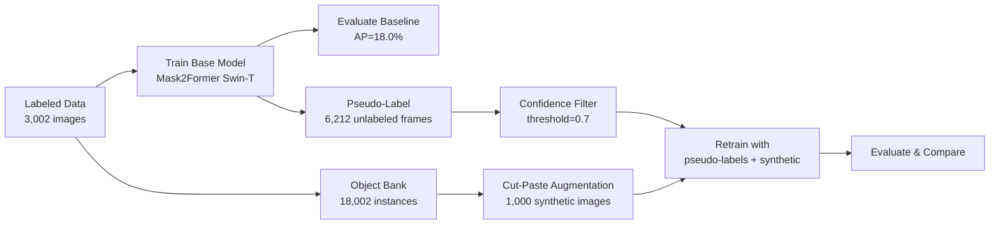

# Waste Segmentation Bootstrapping Pipeline

A production-quality pipeline for bootstrapping instance segmentation models at new Materials Recovery Facility (MRF) sites with minimal manual annotation. Uses the [ZeroWaste dataset](https://zenodo.org/records/6412647) (real conveyor belt footage) to demonstrate how a pretrained model can be rapidly adapted to a new facility using only unlabeled footage.

## The Problem

Every time a waste sorting system is deployed at a new MRF, the model faces different waste compositions, belt colors, lighting, and clutter levels. Getting good performance requires collecting and annotating site-specific data — expensive and slow. This pipeline reduces that cost by:

1. **Training a base model** on existing labeled data
2. **Generating pseudo-labels** on unlabeled footage from the new site
3. **Synthesizing additional training data** via cut-paste augmentation
4. **Retraining** to measure improvement over the supervised baseline

## Pipeline



## Results

Baseline model trained on the ZeroWaste-f labeled split (3,002 images, 4 classes). Evaluated on the test split (929 images) using COCO instance segmentation metrics.

| Metric | Baseline (50 ep) | + Augmentation (10 ep) |
|--------|:---:|:---:|
| **AP** | **18.0** | 15.9 |
| AP50 | 26.1 | 23.2 |
| AP75 | 19.3 | 17.3 |
| AR | 31.2 | 28.3 |
| AP rigid_plastic | 2.7 | **4.6** |
| AP cardboard | **35.6** | 32.0 |
| AP metal | **9.3** | 3.4 |
| AP soft_plastic | **24.3** | 23.4 |

**Key observations:**
- The baseline achieves 18% AP with transfer learning from COCO-pretrained Mask2Former — reasonable for a challenging waste segmentation task with severe occlusion and deformation
- Cut-paste augmentation improved the **rarest class** (rigid_plastic: 2.7% → 4.6%) even at 10 epochs, suggesting synthetic data helps with class imbalance
- The baseline model overfits after ~8 epochs (eval loss bottoms at 20.9, rises to 33.6 by epoch 50), indicating the dataset would benefit from additional training data — exactly what pseudo-labeling provides
- The augmented model was trained for only 10 epochs vs 50 for baseline; a fair comparison would use early stopping for both

## Dataset

[ZeroWaste](https://zenodo.org/records/6412647) (Bashkirova et al., CVPR 2022): real conveyor belt footage from a waste sorting plant.

| Split | Images | Annotations |
|-------|-------:|------------:|
| Train | 3,002 | 18,002 |
| Val | 572 | — |
| Test | 929 | — |
| Unlabeled | 6,212 | — |

**Classes:** rigid_plastic, cardboard, metal, soft_plastic

**Resolution:** 1920 x 1080 (resized to 384x384 for training)

## Architecture

- **Model:** [Mask2Former](https://arxiv.org/abs/2112.01527) with Swin-Tiny backbone, pretrained on COCO
- **Framework:** HuggingFace Transformers (not detectron2 — archived, CUDA-only ops incompatible with Apple Silicon)
- **Training:** HuggingFace Trainer with FP16, batch size 8, lr=1e-5, AdamW
- **Hardware:** NVIDIA L4 (24GB) on [Modal](https://modal.com) (~$0.80/hr)

## Project Structure

```
zerowaste_bootstrap/
├── cli.py                    # Typer CLI: download, train, evaluate, pseudo-label, augment, compare
├── config.py                 # Pydantic settings: paths, hyperparams, thresholds
├── data/
│   ├── download.py           # ZeroWaste download from Zenodo (password-protected)
│   ├── dataset.py            # COCO adapter for Mask2Former, dataset merging
│   └── augmentation.py       # Object bank extraction + cut-paste synthesis
├── modeling/
│   ├── model.py              # Mask2Former loading with ZeroWaste class head
│   └── trainer.py            # HF Trainer wrapper with smoke test support
├── pseudo_label/
│   ├── generate.py           # Batch inference on unlabeled data
│   └── filter.py             # Confidence + area filtering
└── evaluation/
    ├── metrics.py            # COCO mAP/mAR evaluation
    ├── compare.py            # Experiment comparison tables
    └── visualize.py          # Prediction overlays + comparison grids

modal_train.py                # Modal app: GPU training, eval, pseudo-labeling in the cloud
tests/                        # 142 tests, 83% coverage
```

## Quickstart

### Prerequisites

- Python 3.12+
- [uv](https://docs.astral.sh/uv/) for dependency management
- [Modal](https://modal.com) account for cloud GPU training (optional — can train locally on MPS/CUDA)

### Setup

```bash
git clone https://github.com/your-username/zerowaste-bootstrap.git
cd zerowaste-bootstrap
uv sync
```

### Download Data

```bash
# Via Modal (recommended — cloud-to-cloud, faster):
modal run modal_train.py --action download

# Or locally:
uv run zerowaste-bootstrap download --data-dir ./data
```

### Train

```bash
# Smoke test (2 epochs, 10 samples — verify everything works):
modal run modal_train.py --action smoke-test

# Full baseline training (50 epochs on L4, ~4.5 hours):
modal run modal_train.py --action train --experiment baseline --epochs 50

# Or locally on MPS/CUDA:
uv run zerowaste-bootstrap train --data-dir ./data --device mps --smoke-test
```

### Evaluate

```bash
modal run modal_train.py --action evaluate --experiment baseline --split test
```

### Pseudo-Label + Augment

```bash
# Generate pseudo-labels on unlabeled data:
modal run modal_train.py --action pseudo-label

# Generate synthetic cut-paste images:
modal run modal_train.py --action augment

# Train with additional data:
modal run modal_train.py --action train --experiment augment --epochs 10
modal run modal_train.py --action train --experiment pseudo --epochs 10
modal run modal_train.py --action train --experiment both --epochs 10
```

### Run Tests

```bash
uv run pytest tests/ -v -k "not slow"          # fast tests (no model download)
uv run pytest tests/ -v --cov=zerowaste_bootstrap  # with coverage
```

## Cost Breakdown (Modal)

| Step | GPU | Time | Cost |
|------|-----|------|------|
| Data download | CPU | ~15 min | ~$0.01 |
| Smoke test | L4 | ~3 min | ~$0.04 |
| Baseline (50 ep) | L4 | ~4.5 hr | ~$3.60 |
| Pseudo-labeling | L4 | ~1.5 hr | ~$1.20 |
| Augmentation | CPU | ~50 min | ~$0.04 |
| Ablation run (10 ep) | L4 | ~1 hr | ~$0.80 |

## References

- Bashkirova et al., "ZeroWaste Dataset: Towards Deformable Object Segmentation in Cluttered Scenes," CVPR 2022
- Kucharski et al., "Data-centric approach for instance segmentation in optical waste sorting," ScienceDirect 2024
- Cheng et al., "Masked-attention Mask Transformer for Universal Image Segmentation," CVPR 2022

## License

Code: MIT. Dataset: [CC BY-NC 4.0](https://creativecommons.org/licenses/by-nc/4.0/) (ZeroWaste).
